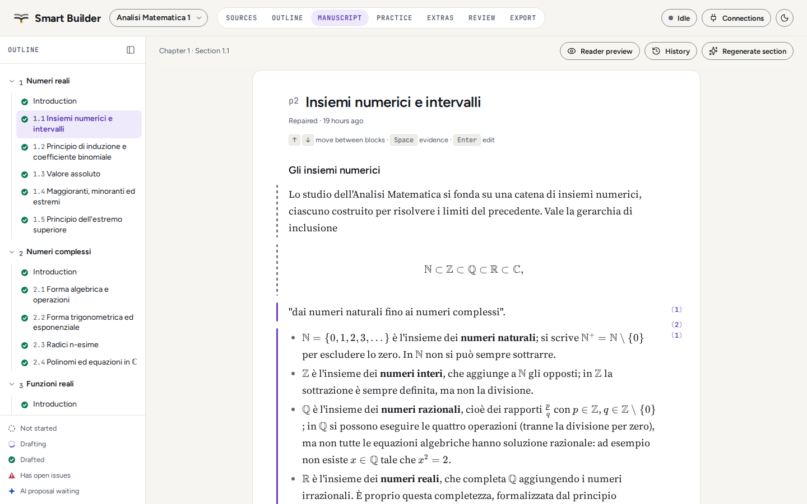
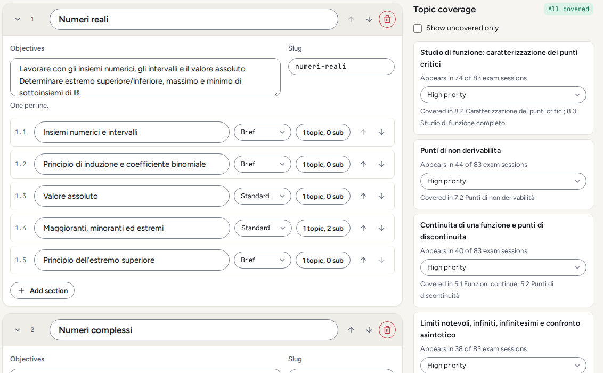
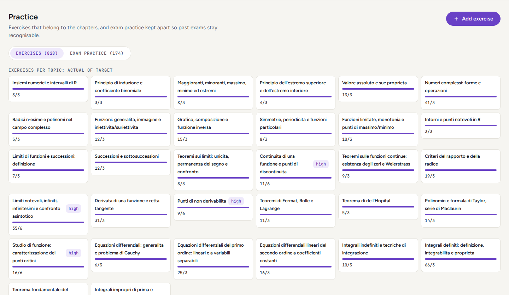

# Smart Builder

A tool that turns course material into an interactive textbook. Add lecture notes, textbooks and past exams. It drafts a cited book with formulas, exercises and exam practice, and you edit it before export.

[](https://github.com/SuperTost100/politost-smartbook-builder/actions/workflows/ci.yml)
[](LICENSE)

<picture>
  <source media="(prefers-color-scheme: dark)" srcset="docs/screenshots/manuscript-dark.png">
  
</picture>

## Why Smart Builder

A model asked to write a textbook chapter writes something fluent, and you can't tell which parts came from your course. Smart Builder works the other way round. It finds the passages in your sources first, writes from them, and shows you the original page behind every citation. A quote it can't find on its page is dropped.

It also reads your past exams. It counts how many exam sessions test each topic, so the book spends its depth and its exercises where the exams do.

It runs on your computer. The AI work goes through the command-line tools you already pay for (Claude Code, Codex, Cursor Agent, Antigravity) by way of [cli-funnel](https://github.com/SuperTost100/cli-funnel), plus NotebookLM if you use it. There is no API bill and no account to create. The finished book is a `.ptsb` file that the [Smartbook reader](https://github.com/SuperTost100/politost-smartbook) and [Pyxis](https://github.com/SuperTost100/politost-pyxis) open.

## What it does

1. **Reads your sources.** PDF (text or scanned), Word, PowerPoint, Markdown and web pages. Pages whose math the PDF text layer garbles go to a vision model.
2. **Maps the course.** It keeps each source's own index, splits past exams into sessions and questions, and counts how often each topic appears.
3. **Proposes an outline** that you edit and approve. Topics the exams test often get deeper sections and more exercises.
4. **Writes each section from evidence.** NotebookLM, or a local search plus a reader model, returns verbatim passages. Each one is located on its page before the writer may cite it.
5. **Checks its own output.** Lint catches broken formulas, leftover model commentary and Unicode math. A second model solves every exercise again, Python examples run in Pyodide, and graphs are evaluated over their domain.
6. **Lets you finish the book.** Edit any block with a live formula preview, regenerate a passage with an instruction, accept or reject AI proposals, and export a validated `.ptsb`.

Your edits are never overwritten. AI output that arrives after you changed a section becomes a proposal you accept or reject.

<table>
  <tr>
    <td width="50%">
      <picture>
        <source media="(prefers-color-scheme: dark)" srcset="docs/screenshots/outline-dark.png">
        
      </picture>
    </td>
    <td width="50%">
      <picture>
        <source media="(prefers-color-scheme: dark)" srcset="docs/screenshots/practice-dark.png">
        
      </picture>
    </td>
  </tr>
  <tr>
    <td>The outline shows how many exam sessions test each topic.</td>
    <td>Exercises per topic, with the high-priority topics marked.</td>
  </tr>
</table>

## Requirements

- Node.js 22.13 or newer. 24 is recommended and pinned in `.nvmrc`.
- At least one signed-in AI command-line tool: [Claude Code](https://docs.claude.com/en/docs/claude-code), [Codex](https://github.com/openai/codex), Cursor Agent or Antigravity.
- Optional: [`nlm`](https://github.com/jacob-bd/gemini-notebook-mcp-cli) for NotebookLM evidence, and LibreOffice for Word and PowerPoint files.

## Start

```bash
git clone https://github.com/SuperTost100/politost-smartbook-builder.git
cd politost-smartbook-builder
npm ci
npm run doctor     # what is installed and signed in, and how to fix the rest
npm start          # builds the web app and opens on http://localhost:5300
```

To use it from another device on your network, such as a laptop reaching a desktop over Tailscale:

```bash
npm start -- --lan
```

The command prints a link with an access token. Open it once on each device. Without the token, the service refuses every request.

Closing the browser does not stop generation. Stopping the service pauses it, and the next start resumes where it left off.

## Your data

Everything lives in one folder: the database, your original files, rendered pages, figures and exports. On Linux that's `~/.local/share/politost-smart-builder`. [Setup](docs/SETUP.md#data) lists the other systems, and `--data-dir` or `SMARTBUILDER_DATA_DIR` moves it. `npm run backup` writes the whole folder to one archive, and it's safe to run while the service is running.

Your sources go to the AI tools you configured and, if you use it, to the book's NotebookLM notebook. Exclude a source on the Sources screen to keep it out. The models run with every tool disabled, so they only read the text Smart Builder sends and can't run commands or touch your files.

## Development

```bash
npm run dev          # service in watch mode, web app on Vite at http://localhost:5173
npm run typecheck
npm test
npm run test:e2e     # Playwright tests for the web app
```

CI runs `typecheck`, `test` and the web build on every push.

## Documentation

| Read this                                | To learn                                                     |
| ---------------------------------------- | ------------------------------------------------------------ |
| [Setup and model routing](docs/SETUP.md) | Signing in each tool, which model does which job, NotebookLM |
| [How a book is made](docs/WORKFLOW.md)   | Every step from sources to export, and what each one checks  |
| [Architecture](docs/ARCHITECTURE.md)     | How the service, the queue and the web app fit together      |
| [Status](STATUS.md)                      | What works today and what is still open                      |

## License

AGPL-3.0-or-later. Smart Builder uses [MuPDF](https://mupdf.com/) (AGPL) for PDF reading and code adapted from the [Smartbook reader](https://github.com/SuperTost100/politost-smartbook) (AGPL). Books you make with it are yours and aren't covered by this license.
